<div align="center">


<br><br>



</div>

<br>

<table width="100%">
<tr>
<td width="65%" valign="top">

### 📟 TERMINAL — `whoami`

```yaml
name:        Balajee A V
role:        Java Backend Engineer @ TCS BaNCS
desk:        Core Banking · Trade Finance · Payments
clients:     Deutsche Bank | Burgan Bank | Khan Bank | TJSB
experience:  3 YOE (and compounding)
status:      🟢 OPEN TO OPPORTUNITIES
strategy:    Ship. Learn in public. Document everything.
```

</td>
<td width="35%" valign="top">

### 📈 TODAY'S WATCHLIST

| Symbol | Asset | Chg |
|:------:|:------|:---:|
| `JAVA` | Core Language | 🟢 +12% |
| `SPBT` | Spring Boot | 🟢 +9% |
| `KFKA` | Kafka | 🟢 +7% |
| `RDIS` | Redis | 🟢 +5% |
| `SQL`  | PostgreSQL | 🟢 +6% |
| `SYS`  | System Design | 🟡 +3% |

</td>
</tr>
</table>

---

<div align="center">

### 🕯️ CAREER CANDLESTICK CHART — 3Y Performance



<sub>Green candles = shipped a project or leveled up · Blue line = trajectory · 🔵 blinking dot = current position (still open)</sub>

</div>

---

<div align="center">

### 💹 POSITION SUMMARY — What I'm Building

</div>

<table width="100%">
<tr>
<td width="50%" valign="top">

**🔴🟢 AML SENTINEL AI** `IN PROGRESS`
> Enterprise anti-money-laundering platform — graph-based transaction intelligence.
> `Spring Boot` `FastAPI` `React 19` `Neo4j` `Kafka` `Docker`

**📜 TRADEPILOT** `SHIPPED`
> AI-powered Letter of Credit processing engine — 7-service microarchitecture.
> `Java 21` `Spring Boot` `Kafka` `GPT-4` `Docker Compose`

</td>
<td width="50%" valign="top">

**🧬 CUSTOMER FINANCIAL TWIN** `SHIPPED`
> Digital twin for financial behavior — Monte Carlo simulation + credit scoring.
> `Spring Boot` `Flask/ML` `React TS` `Docker`

**📊 THE SERIES** `ONGOING`
> *10 Weeks × 10 AI + Banking System Concepts* — building in public, one system a week.
> `LinkedIn` `Medium` `avbalajee.vercel.app`

</td>
</tr>
</table>

<div align="center">

</div>

<br>

<div align="center">

### 📡 LIVE MARKET DATA


</div>

<br>

<div align="center">

### 🧰 INSTRUMENTS TRADED (Tech Stack)


</div>

<br>

<div align="center">

### 🔗 EXECUTE ORDER — Connect

<a href="https://www.linkedin.com/in/balajeevg-techclog/"></a>
<a href="mailto:balajeevg@gmail.com"></a>
<a href="https://avbalajee.vercel.app/"></a>
<a href="https://github.com/AVBalajee"></a>

</div>

<br>

<div align="center">

> `"Markets fluctuate. Clean architecture doesn't."`


<sub>🟢 STATUS: OPEN — Thanks for stopping by the terminal. Let's build something that compounds.</sub>

</div>

<!--
SETUP NOTE (delete this comment once done, GitHub won't render it anyway):
This README uses two custom-built animated SVGs that live in an /assets folder next to it:
  assets/candlestick-chart.svg  -> the animated candlestick chart
  assets/ticker-tape.svg        -> the scrolling skills ticker
Commit both files at that relative path in your profile repo (github.com/AVBalajee/AVBalajee)
so the  references resolve. Both are pure SVG + SMIL animation,
no JS, no external chart service, so they load instantly and never go down.
-->
